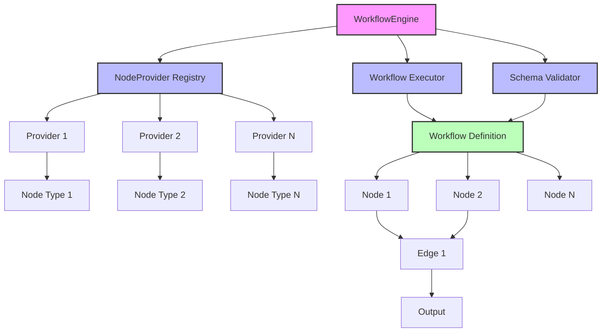

# FUSE (Utility for Stateful Events)

A flexible and extensible workflow engine for building end-to-end automations and tasks. FUSE follows SOLID principles and provides a modular architecture where each node can be implemented as an independent package.

## Features

- Modular node system with provider-based architecture
- In-memory execution with support for future protocol-based communication
- Flexible workflow definition with nodes and edges
- Support for conditional edge traversal
- Context-aware execution
- Built-in validation for workflows and nodes
- CI/CD pipeline with automated testing and linting
- Schema-based workflow definition for consistency and validation

## Architecture



The workflow engine consists of several key components:

1. **Node**: Represents a single step in the workflow

   - Each node has a unique ID
   - Nodes can execute logic and validate their configuration
   - Nodes communicate through a common interface

2. **NodeProvider**: Responsible for creating and managing nodes

   - Providers register with the workflow engine
   - Each provider can create specific types of nodes
   - Providers validate node configurations

3. **Workflow**: Defines the complete automation

   - Contains a list of nodes
   - Defines edges (connections) between nodes
   - Supports conditional edge traversal

4. **WorkflowEngine**: Orchestrates the execution

   - Manages node providers
   - Executes workflows
   - Validates workflow definitions

5. **Schema**: Defines the structure for workflows
   - Provides a standardized format for workflow definitions
   - Enables validation of workflow structures
   - Supports versioning of workflow definitions
   - Ensures compatibility between different system components

## Development

### Prerequisites

- Go 1.21 or later
- Make
- golangci-lint (automatically installed by Make)

### Building

```bash
make build
```

### Testing

```bash
make test
```

### Linting

```bash
make lint
```

### Running

```bash
make run
```

## CI/CD Pipeline

The project includes a GitHub Actions pipeline that runs on every push to `main` and pull requests. The pipeline:

1. Sets up Go environment with dependency caching
2. Installs golangci-lint
3. Runs the test suite
4. Performs code linting
5. Builds the project

The pipeline ensures code quality and prevents merging of broken code into the main branch.

## Example Usage

```go
// Create a new workflow engine
engine := workflow.NewDefaultEngine()

// Register a node provider
engine.RegisterProvider(examples.NewStringProcessorProvider())

// Create a workflow with schema validation
wf := &workflow.Workflow{
    ID:   "example_workflow",
    Name: "Example Workflow",
    SchemaVersion: "1.0",
}

// Create nodes
node1, _ := provider.CreateNode(config1)
node2, _ := provider.CreateNode(config2)

// Add nodes and edges
wf.Nodes = []workflow.Node{node1, node2}
wf.Edges = []workflow.Edge{
    {FromNodeID: node1.ID(), ToNodeID: node2.ID()},
}

// Execute the workflow
result, err := engine.ExecuteWorkflow(ctx, wf, input)
```

## Creating Custom Nodes

To create a custom node:

1. Implement the `Node` interface
2. Create a `NodeProvider` for your node type
3. Register the provider with the workflow engine

Example:

```go
type MyNode struct {
    id string
    config MyConfig
}

func (n *MyNode) ID() string {
    return n.id
}

func (n *MyNode) Execute(ctx context.Context, input interface{}) (interface{}, error) {
    // Implement your node logic here
}

func (n *MyNode) Validate() error {
    // Implement validation logic
}
```

## Schema System

FUSE includes a schema system that provides a standardized way to define workflows. The schema:

- Validates workflow structure and node configurations
- Ensures type safety for node inputs and outputs
- Allows for workflow versioning and backward compatibility
- Supports documentation generation from schema definitions
- Enables tooling for visual workflow design

## Workflow Definition Examples

### YAML Workflow Definition

Workflows can be defined using YAML for improved readability and maintainability:

```yaml
# Basic workflow example
id: example_workflow
name: Example Workflow
schemaVersion: "1.0"
nodes:
  - id: input_node
    type: input
    config:
      format: json

  - id: process_node
    type: string_processor
    config:
      operation: uppercase

  - id: output_node
    type: output
    config:
      format: json

edges:
  - fromNodeId: input_node
    toNodeId: process_node
    condition: "{{ $.input.length > 0 }}"

  - fromNodeId: process_node
    toNodeId: output_node
```

### Schema-Validated Workflow

This example shows a workflow with schema validation and typed inputs/outputs:

```yaml
# Schema-validated workflow with typed interfaces
id: data_transform_workflow
name: Data Transformation Pipeline
schemaVersion: "1.1"
schema:
  $ref: "https://schemas.fuse.io/workflows/data-transform/v1.1.json"

nodes:
  - id: csv_input
    type: file_reader
    config:
      path: "{{ $.params.inputFile }}"
      format: csv
    outputSchema:
      type: array
      items:
        type: object
        properties:
          name: { type: string }
          age: { type: number }
          email: { type: string }

  - id: filter_adults
    type: data_filter
    config:
      condition: "{{ $.item.age >= 18 }}"
    inputSchema:
      $ref: "#/nodes/csv_input/outputSchema"
    outputSchema:
      $ref: "#/nodes/csv_input/outputSchema"

  - id: transform_emails
    type: data_mapper
    config:
      mapping:
        - source: "{{ $.item.email }}"
          target: "email"
          transform: "lowercase"
        - source: "{{ $.item.name }}"
          target: "username"
          transform: "{{ $.source.split(' ')[0].toLowerCase() }}"
    inputSchema:
      $ref: "#/nodes/filter_adults/outputSchema"
    outputSchema:
      type: array
      items:
        type: object
        properties:
          username: { type: string }
          email: { type: string }

  - id: json_output
    type: file_writer
    config:
      path: "{{ $.params.outputFile }}"
      format: json
    inputSchema:
      $ref: "#/nodes/transform_emails/outputSchema"

edges:
  - fromNodeId: csv_input
    toNodeId: filter_adults
  - fromNodeId: filter_adults
    toNodeId: transform_emails
  - fromNodeId: transform_emails
    toNodeId: json_output
```

### Loading and Executing YAML Workflows

```go
// Load a workflow from YAML
yamlData, err := ioutil.ReadFile("workflow.yaml")
if err != nil {
    log.Fatal(err)
}

// Parse and validate against schema
wf, err := workflow.ParseYAML(yamlData)
if err != nil {
    log.Fatal(err)
}

// Execute the workflow with parameters
params := map[string]interface{}{
    "inputFile": "data/input.csv",
    "outputFile": "data/output.json",
}

result, err := engine.ExecuteWorkflow(ctx, wf, params)
if err != nil {
    log.Fatal(err)
}
```

## Future Enhancements

- Protocol-based communication between nodes
- Support for distributed execution
- Persistence layer for workflow definitions
- Monitoring and metrics
- Error recovery and retry mechanisms
- Workflow versioning
