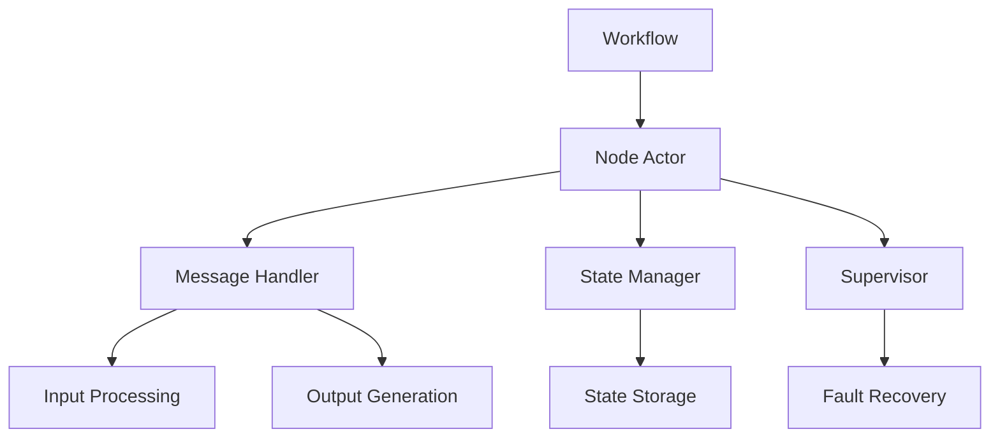

# FUSE (FUSE Utility for Stateful Events)

A flexible and extensible workflow engine built on the ergo actor model for building end-to-end automations and tasks.

## ⚠️ Development Status

This project is currently under active development and is not yet ready for production use. The APIs, interfaces, and functionality are subject to change without notice. We recommend waiting for a stable release before using FUSE in any production environment.

## Overview

FUSE is a workflow engine that enables the creation of complex automation pipelines through a system of interconnected nodes, powered by the ergo actor model. Each node in the workflow operates as an independent actor, processing data, making decisions, and communicating with other nodes through message passing.

## Core Concepts

### Actor Model Implementation

FUSE leverages the ergo actor model to provide:

- **Isolated Execution**: Each node runs as an independent actor
- **Message Passing**: Asynchronous communication between nodes
- **Supervision**: Built-in fault tolerance and recovery
- **State Management**: Actor-based state handling
- **Scalability**: Distributed execution capabilities

### Node

A Node is the fundamental building block of a workflow. Each node:

- Operates as an ergo actor
- Has a unique identifier
- Defines input and output metadata
- Executes specific logic
- Can operate in both synchronous and asynchronous modes
- Returns standardized results

### Node Metadata

Nodes define their interface through metadata that includes:

- Input parameters with validation rules
- Output specifications
- Edge configuration for connecting nodes
- Parameter schemas with type checking and validation

## Architecture



## Features

- **Actor-Based Architecture**: Built on ergo actor model for robust concurrent execution
- **Type-Safe Interfaces**: Strong typing and validation for node inputs and outputs
- **Flexible Execution**: Support for both synchronous and asynchronous node execution
- **Metadata-Driven**: Comprehensive metadata system for defining node interfaces
- **Validation Rules**: Built-in support for parameter validation with custom rules
- **Edge Management**: Configurable edge connections between nodes
- **Parameter Schemas**: Detailed schema definitions for node parameters
- **Fault Tolerance**: Built-in supervision and recovery mechanisms
- **State Management**: Actor-based state handling and persistence

## Project Structure

The project follows a clean architecture with the following structure:

- `pkg/workflow`: Core workflow engine implementation
- `pkg/actor`: Actor model implementation using ergo
- `pkg/debug`: Debugging utilities
- `pkg/logic`: Common logic operations
- `pkg/uuid`: UUID generation utilities
- `internal/`: Internal packages (not for external use)
- `cmd/`: Command-line applications
- `docs/`: Documentation
- `examples/`: Example workflows and usage patterns

## Example Workflows

FUSE includes several example workflows in the `examples/` directory:

1. **Smallest Test** (`smallest-test.json`): A basic workflow demonstrating node connections
2. **Mermaid Test** (`mermaid-test.json`): Example of complex workflow visualization
3. **Loop Test** (`mermaid-loop-test.json`): Demonstrates loop handling in workflows
4. **Conditional Test** (`small-cond-test.json`): Shows conditional branching
5. **Random Branch** (`sum-rand-branch.json`): Example of random number generation and branching

## Getting Started

### Prerequisites

- Go 1.24 or later
- Make
- golangci-lint

### Building

```bash
make build
```

### Testing

```bash
make test
```

### Linting

```bash
make lint
```

## Contributing

Please see [./docs/CONTRIBUTE.md](docs/CONTRIBUTE.md) for detailed information about:

- Setting up your development environment
- Code conventions and project structure
- Submitting pull requests
- Commit message guidelines

## License

[License information to be added]

## Setup

Follow the instructions on [SETUP](./docs/SETUP.md)
