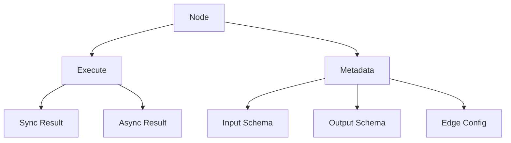

# FUSE (Utility for Stateful Events)

A flexible and extensible workflow engine for building end-to-end automations and tasks.

## ⚠️ Development Status

This project is currently under active development and is not yet ready for production use. The APIs, interfaces, and functionality are subject to change without notice. We recommend waiting for a stable release before using FUSE in any production environment.

## Overview

FUSE is a workflow engine that enables the creation of complex automation pipelines through a system of interconnected nodes. Each node in the workflow can process data, make decisions, and pass results to subsequent nodes through a standardized interface.

## Core Concepts

### Node

A Node is the fundamental building block of a workflow. Each node:

- Has a unique identifier
- Defines input and output metadata
- Executes specific logic
- Can operate in both synchronous and asynchronous modes
- Returns standardized results

### Node Metadata

Nodes define their interface through metadata that includes:

- Input parameters with validation rules
- Output specifications
- Edge configuration for connecting nodes
- Parameter schemas with type checking and validation

### Node Results

Nodes can return results in two ways:

1. Synchronous: Immediate results with status and data
2. Asynchronous: Results streamed through a channel

## Architecture



## Features

- **Type-Safe Interfaces**: Strong typing and validation for node inputs and outputs
- **Flexible Execution**: Support for both synchronous and asynchronous node execution
- **Metadata-Driven**: Comprehensive metadata system for defining node interfaces
- **Validation Rules**: Built-in support for parameter validation with custom rules
- **Edge Management**: Configurable edge connections between nodes
- **Parameter Schemas**: Detailed schema definitions for node parameters

## Getting Started

### Prerequisites

- Go 1.21 or later
- Make
- golangci-lint

### Building

```bash
make build
```

### Testing

```bash
make test
```

### Linting

```bash
make lint
```

## Example Usage

```go
// Define a custom node
type MyNode struct {
    id string
    metadata NodeMetadata
}

func (n *MyNode) ID() string {
    return n.id
}

func (n *MyNode) Metadata() NodeMetadata {
    return n.metadata
}

func (n *MyNode) Execute(input NodeInput) (NodeResult, error) {
    // Process input
    result := processData(input)

    // Return synchronous result
    return NewNodeResult(NodeOutputStatusSuccess, result), nil
}

// Create node metadata
metadata := NewNodeMetadata(
    InputOutputMetadata{
        Parameters: Parameters{
            "input": ParameterSchema{
                Name:        "input",
                Type:        "string",
                Required:    true,
                Validations: []string{"len>0"},
            },
        },
    },
    InputOutputMetadata{
        Parameters: Parameters{
            "output": ParameterSchema{
                Name: "output",
                Type: "string",
            },
        },
    },
)
```

## Project Structure

The project follows a clean architecture with the following structure:

- `pkg/workflow`: Core workflow engine implementation
- `pkg/uuid`: UUID generation utilities
- `internal/`: Internal packages (not for external use)
- `cmd/`: Command-line applications
- `docs/`: Documentation

## Contributing

Please see [CONTRIBUTE.md](docs/CONTRIBUTE.md) for detailed information about:

- Setting up your development environment
- Code conventions and project structure
- Submitting pull requests
- Commit message guidelines

## License

[License information to be added]
