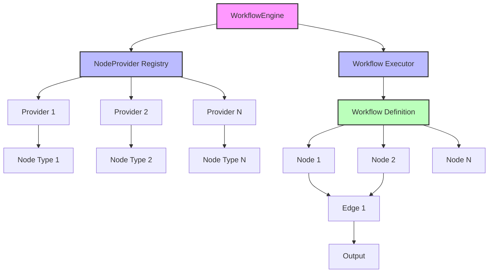

# Core Workflow Engine

A flexible and extensible workflow engine for building end-to-end automations and tasks. This engine follows SOLID principles and provides a modular architecture where each node can be implemented as an independent package.

## Features

- Modular node system with provider-based architecture
- In-memory execution with support for future protocol-based communication
- Flexible workflow definition with nodes and edges
- Support for conditional edge traversal
- Context-aware execution
- Built-in validation for workflows and nodes
- CI/CD pipeline with automated testing and linting

## Architecture



The workflow engine consists of several key components:

1. **Node**: Represents a single step in the workflow

   - Each node has a unique ID
   - Nodes can execute logic and validate their configuration
   - Nodes communicate through a common interface

2. **NodeProvider**: Responsible for creating and managing nodes

   - Providers register with the workflow engine
   - Each provider can create specific types of nodes
   - Providers validate node configurations

3. **Workflow**: Defines the complete automation

   - Contains a list of nodes
   - Defines edges (connections) between nodes
   - Supports conditional edge traversal

4. **WorkflowEngine**: Orchestrates the execution
   - Manages node providers
   - Executes workflows
   - Validates workflow definitions

## Development

### Prerequisites

- Go 1.21 or later
- Make
- golangci-lint (automatically installed by Make)

### Building

```bash
make build
```

### Testing

```bash
make test
```

### Linting

```bash
make lint
```

### Running

```bash
make run
```

## CI/CD Pipeline

The project includes a GitHub Actions pipeline that runs on every push to `main` and pull requests. The pipeline:

1. Sets up Go environment with dependency caching
2. Installs golangci-lint
3. Runs the test suite
4. Performs code linting
5. Builds the project

The pipeline ensures code quality and prevents merging of broken code into the main branch.

## Example Usage

```go
// Create a new workflow engine
engine := workflow.NewDefaultEngine()

// Register a node provider
engine.RegisterProvider(examples.NewStringProcessorProvider())

// Create a workflow
wf := &workflow.Workflow{
    ID:   "example_workflow",
    Name: "Example Workflow",
}

// Create nodes
node1, _ := provider.CreateNode(config1)
node2, _ := provider.CreateNode(config2)

// Add nodes and edges
wf.Nodes = []workflow.Node{node1, node2}
wf.Edges = []workflow.Edge{
    {FromNodeID: node1.ID(), ToNodeID: node2.ID()},
}

// Execute the workflow
result, err := engine.ExecuteWorkflow(ctx, wf, input)
```

## Creating Custom Nodes

To create a custom node:

1. Implement the `Node` interface
2. Create a `NodeProvider` for your node type
3. Register the provider with the workflow engine

Example:

```go
type MyNode struct {
    id string
    config MyConfig
}

func (n *MyNode) ID() string {
    return n.id
}

func (n *MyNode) Execute(ctx context.Context, input interface{}) (interface{}, error) {
    // Implement your node logic here
}

func (n *MyNode) Validate() error {
    // Implement validation logic
}
```

## Future Enhancements

- Protocol-based communication between nodes
- Support for distributed execution
- Persistence layer for workflow definitions
- Monitoring and metrics
- Error recovery and retry mechanisms
- Workflow versioning
