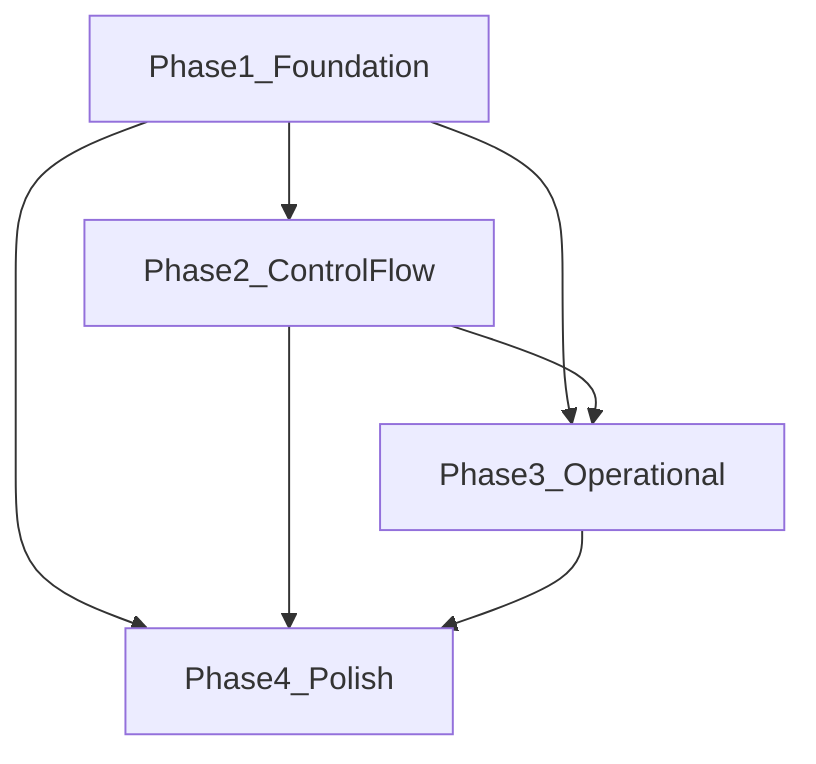
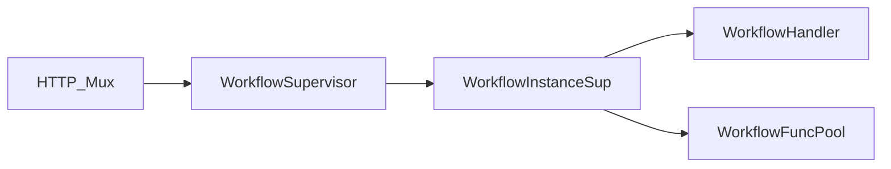

# FUSE (FUSE Utility for Stateful Events)

A workflow engine built on the **[ergo.services](https://docs.ergo.services/) actor model**: each step runs as an isolated actor with message passing, supervision, and room to grow into **durable, production-grade execution**—the same foundation you want for **AI workflows** and **agentic orchestration** (long-running steps, human-in-the-loop, event-driven triggers, idempotent triggers, and observable runs).

## Status

FUSE is under active development. It is suitable for **development, experimentation, and pilots**. Running **multiple replicas** or treating the engine as **HA production** without additional work is **not** recommended yet: workflow state and repositories are still primarily **in-memory**, and the [roadmap](docs/roadmap/README.md) (Phase 1 onward) describes **durable execution**, **persistence**, and **shared stores** needed for safe multi-instance deployment.

A dedicated **documentation portal** is planned later; today, this README, [docs/API.md](docs/API.md), Swagger at `/docs`, and [docs/roadmap/](docs/roadmap/) are the sources of truth.

## What works today

- **Graph workflows**: nodes and edges, validation, trigger-oriented execution
- **Control flow**: conditional branching, parallel branches, joins, graph-level loops
- **Async nodes**: external completion via HTTP callback
- **HTTP API**: health, trigger workflow, upsert/get schema, list/register packages, async result submission
- **Packages**: internal and external function registration, HTTP and internal transports
- **Actor supervision**: mux server, workflow supervisor, per-workflow handlers and worker pools

See the [current state](docs/roadmap/README.md#current-state-what-exists-today) table in the roadmap for issue-level detail.

## Roadmap at a glance

Detailed designs live in the phase documents. Implement in order **Phase 1 → 4** where dependencies apply.

| Phase | Theme | Headlines |
| ----- | ----- | --------- |
| [1 — Foundation](docs/roadmap/phase-1-foundation.md) | Reliable execution | Durable execution / journal & resume, retries & error edges, per-node & workflow timeouts, graceful actor cleanup, input mapping validation |
| [2 — Control flow](docs/roadmap/phase-2-control-flow.md) | Powerful graphs | Durable sleep & wait-for-event (awakeables), cancellation API, sub-workflows, expr-based conditionals & default edges, merge strategies at joins |
| [3 — Operational](docs/roadmap/phase-3-operational.md) | Production operations | Cron / webhook / internal event triggers, concurrency & rate limits, trigger idempotency, persisted execution traces |
| [4 — Polish](docs/roadmap/phase-4-polish.md) | Higher-level patterns | For-each / batch over collections, schema versioning & rollback |


```mermaid
flowchart TD
  P1[Phase1_Foundation]
  P2[Phase2_ControlFlow]
  P3[Phase3_Operational]
  P4[Phase4_Polish]
  P1 --> P2
  P1 --> P3
  P2 --> P3
  P1 --> P4
  P2 --> P4
  P3 --> P4
```

## Scaling

- **Vertical**: Larger CPU/memory limits, tuning worker pool sizes in the mux configuration, and (per roadmap Phase 3) per-function and per-schema **concurrency** and **rate limits** so one workflow cannot overwhelm external APIs.
- **Horizontal**: The Helm chart supports **`standalone`** (Deployment, `replicaCount`) and **`cluster`** (StatefulSet + ergo clustering). For **N &gt; 1** HTTP replicas or a multi-node ergo cluster to be safe, **workflow instances, journals, idempotency, and optional event/bus state must be shared and durable** across processes—see Phase 1 and Phase 3 in the roadmap. Until then, prefer **a single active writer** for workflow state or accept best-effort semantics.

Kubernetes deployment: [docs/DEPLOYMENT.md](docs/DEPLOYMENT.md) and [deploy/helm/fuse/](deploy/helm/fuse/).

## Quick start

**Prerequisites:** Go 1.26+, Make, golangci-lint (see [docs/CONTRIBUTE.md](docs/CONTRIBUTE.md)).

```bash
make build
make test
make lint
make run   # server on port 9090 (see Makefile)
```

**Optional local stack** (LocalStack, etc.): [docs/SETUP.md](docs/SETUP.md).

## API and documentation

- **REST reference (human-readable):** [docs/API.md](docs/API.md)
- **Interactive OpenAPI:** `make swagger` then open `http://localhost:9090/docs` with the server running
- **Swagger generation (contributors):** [docs/README.md](docs/README.md)
- **Roadmap & specs:** [docs/roadmap/README.md](docs/roadmap/README.md)

### Implemented HTTP routes (summary)

| Method | Path |
| ------ | ---- |
| GET | `/health` |
| POST | `/v1/workflows/trigger` |
| PUT, GET | `/v1/schemas/{schemaID}` |
| GET | `/v1/packages` |
| GET, PUT | `/v1/packages/{packageID}` |
| POST | `/v1/workflows/{workflowID}/execs/{execID}` |

**Request JSON:** `POST /v1/workflows/trigger` expects `schemaID` (camelCase key) in the body—see [docs/API.md](docs/API.md).

## Architecture (high level)


```mermaid
flowchart LR
  HTTP[HTTP_Mux]
  Sup[WorkflowSupervisor]
  Inst[WorkflowInstanceSup]
  WH[WorkflowHandler]
  Pool[WorkflowFuncPool]
  HTTP --> Sup
  Sup --> Inst
  Inst --> WH
  Inst --> Pool
```

## Project structure

- `cmd/fuse` — CLI entrypoint
- `internal/app` — config, DI (`internal/app/di`), CLI commands
- `internal/actors` — ergo supervisors, pools, mux, workflow execution
- `internal/handlers` — HTTP WebWorkers
- `internal/services` / `internal/repositories` — business logic and persistence (memory implementations today)
- `internal/workflow` — graph, execution, actions
- `pkg/` — public libraries (workflow types, transport, utilities)
- `examples/` — example workflow JSON
- `deploy/helm/fuse` — Helm chart for Kubernetes

## Contributing

See [docs/CONTRIBUTE.md](docs/CONTRIBUTE.md) (quality gates: `make lint && make build && make test`).

## License

[License information to be added]
